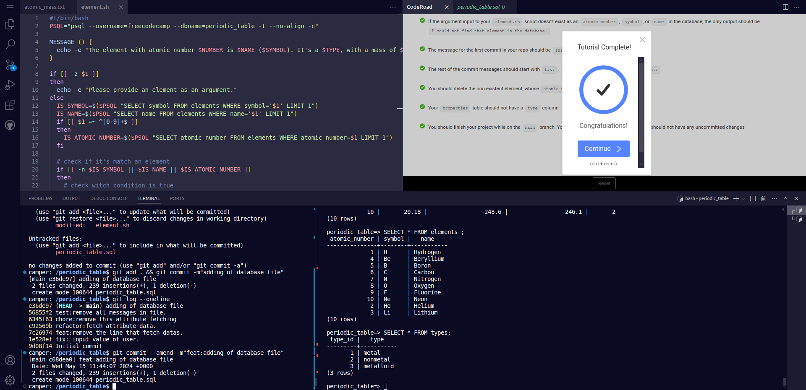

## Build a Periodic Table Database

This is one of the required projects to earn your 
certification. For this project, you will 
create Bash a script to get information 
about chemical elements from a periodic table database.

#### cover image

Thank's freecodecamp 
